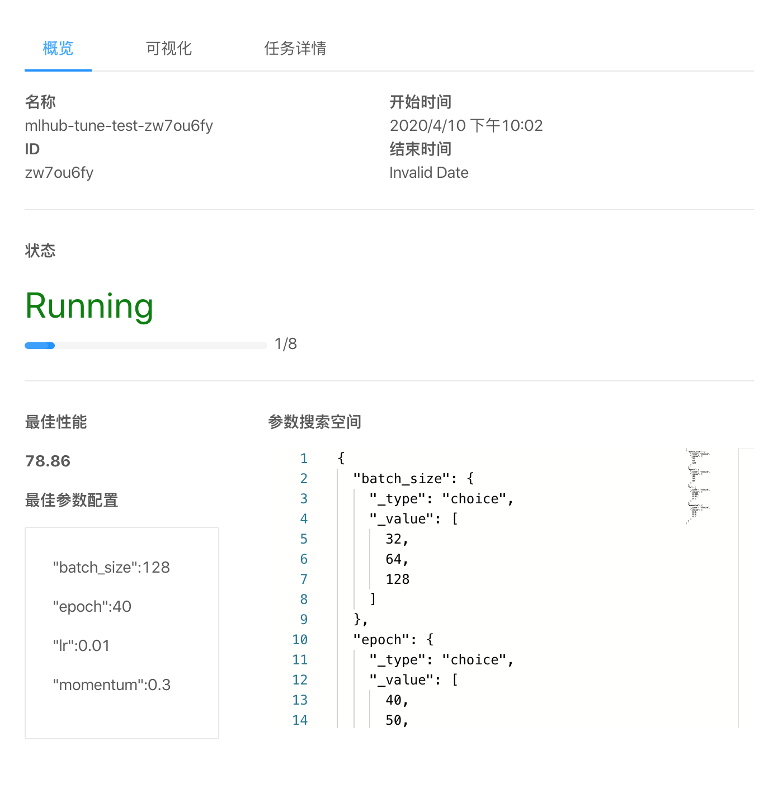

+++
title = "自动化超参数训练"
description = ""
date = 2020-04-08T15:56:45+08:00
weight = 30
draft = false
bref = ""
toc = true
+++

### 功能介绍

自动化的调参是MLhub调参模块的关键功能，主要的应用场景是超参调优。调参模块提供了多种流行的自动调参算法，包括常用的网格搜索（Grid search）、随机搜索（Random search）以及更高级的继续随机序列建模的[TPE](https://papers.nips.cc/paper/4443-algorithms-for-hyper-parameter-optimization.pdf)算法等。

使用调参模块只需要简单的几个步骤，首先，用户在前端定义自己的搜索空间，搜索空间会被整理成指定的JSON格式，并发送到后端。然后，用户在自己的代码中进行修改，只需要在调用我们提供的api来获得新的参数以及报告数据（数据包括性能指标的变化和Loss的变化等）。最后启动任务。后端会根据用户的配置在集群中创建一个Pod来完成这次实验。实验的中间结果和最终结果会被展示在前端。用户可以根据可视化的结果，选择较优的参数或者调整自己的代码。

### 模块设计

||
|:--:| 
|*图 1: 模块设计*|

图1通过一个完整的调参任务流程展示了自动化超参数训练的模块设计，图中的标号代表了数据的传递过程： 

1. 前端将用户定义的实验配置信息，包括搜索空间、启动指令等发送给后端的Launcher

2. Launcher根据实验配置信息，在集群中创建Experiment Pod来完成这次实验，并将实验的配置信息挂载到Experiment Pod中

3. Experiment Pod由Manager和Tuner两个容器构成，Manager负责控制实验的进度，对实验进行统一管理，而Tuner中封装了若干调参算法。Manager在创建新的Trial时，会向Tuner请求新的一组超参数，以及报告已经完成的Trial的结果。

4. Tuner会根据已经完成的Trial的结果，预测搜索空间中更好的参数，并发送给Manager

5. Experiment Pod通过K8s api向部署在集群中的TF/Pytorch operator发送请求，要求新建tfjob/pytorchjob。

6. TF/Pytorch operator根据Experiment Pod的请求创建出Trial Pod。Trial Pod会挂载用户的代码和数据卷，并进行训练和测试。

7. Trial Pod向Experiment Pod中的Manager报告本次Trial的结果（包括Loss的变化，最终的准确度等）

8. Manager获得结果后，将其连同Trial的信息存入数据库。并判断是否要继续进行实验。

9. 前端可以向后端请求实验的数据，并将其可视化，展示给用户，方便用户选择较优的参数。

### 如何使用

#### 修改训练代码

我们提供了一个pytorch的[超参数训练的例子](https://github.com/czhnju161220026/tune-example),首先，我们需要修改训练代码，通过调用dlkit_utils.py中给出的api获取一组参数以及报告训练结果:

``` python
# dlkit_util.py
# 获取一组超参数，类型为dict
def get_parameter():
# 报告最终的训练效果，通常是准确度等评估数据
def report_final_result(data):
# 报告每个epoch的loss数据，用于可视化展示
def report_loss(data):
# 报告每个epoch的训练效果，用于可视化展示
def report_intermediate_result(data):
```

我们需要修改训练代码：

``` python
# train.py
...
def main():
    # 获取超参数
    parameters = get_parameter()
    # 加载数据集
    trainset = dataloader(root=args.dataroot, train=True, download=True, transform=transform_train)
    trainloader = data.DataLoader(dataset=trainset, batch_size=parameters['batch_size'], shuffle=False)
    testset = dataloader(root=args.dataroot, train=False, download=False, transform=transform_test)
    testloader = data.DataLoader(testset, batch_size=parameters['batch_size'], shuffle=False, num_workers=args.workers)
    # 加载模型
    print("==> creating model '{}'".format("Resnet"))
    model = ResNet(depth=args.depth, num_classes=num_classes)
    model = model.cuda() 
    criterion = nn.CrossEntropyLoss()
    optimizer = optim.SGD(model.parameters(), lr=parameters['lr'], momentum=parameters['momentum'], weight_decay=args.weight_decay)

    # Train and test
    result = 0.0
    for epoch in range(parameters['epoch']):
        adjust_learning_rate(optimizer, epoch)
        train_loss, train_acc = train(trainloader, model, criterion, optimizer, epoch, use_cuda)
        test_loss, test_acc = test(testloader, model, criterion, epoch, use_cuda) 
        train_loss, test_loss, train_acc, test_acc))
        # 报告中间结果
        report_intermediate_result(float(test_acc))
        # 报告loss
        report_loss(float(test_loss))
        result = test_acc
    # 报告最终结果
    report_final_result(float(result))
```

#### 创建工作区

在MLhub上，我们通过用户填写git仓库的方式来为新创建的工作区添加代码：

||
|:--:| 
|*图 2: 创建工作区-基础信息*|

#### 任务定制

工作区创建完毕后，我们可以看到新建的工作区:

||
|:--:| 
|*图 3: 工作区列表*|

接着我们可以通过以下两种方式启动一个超参数任务

##### 方式一：前端录入

点击工作区，进入详情页面后，在任务定制面板中，点击增加任务，然后填写具体的任务信息

||
|:--:| 
|*图 4: 任务定制*|

##### 方式二： 在线编辑(推荐)

点击工作区上的vscode按钮，可以进入code server进行在线编辑，可以看到，我们的代码和选择的数据卷已经在code server中：


||
|:--:| 
|*图 5: 在线编辑*|

接着，在终端中执行<code>dlctl nni-init</code>,会生成一个 dlkit-tune.json文件，编辑该文件，填入超参数空间以及训练指令等信息:


||
|:--:| 
|*图 6: 准备任务*|

最后在终端中执行<code>dlctl nni-submit</code>就可以启动调参任务

#### 结果可视化

任务运行时，我们可以在任务详情中查看任务的运行进度、每个子任务的中间结果，Loss变化等信息：


||
|:--:| 
|*图 7: 任务信息*|


||
|:--:| 
|*图 8: 结果可视化*|


||
|:--:| 
|*图 9: 子任务信息*|
