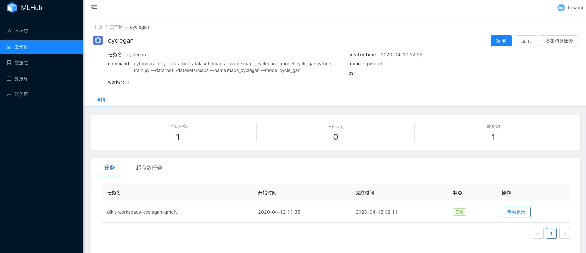
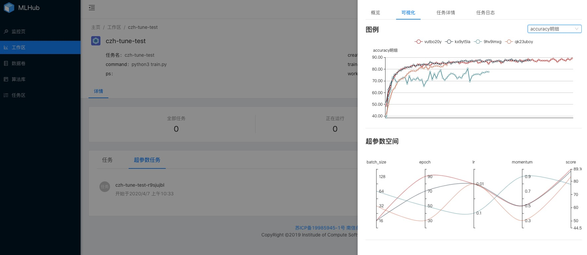

+++
title = "平台概况"
description = "ML Hub系统概况介绍"
date = 2020-04-08T15:34:56+08:00
weight = 1
draft = false
bref = ""
toc = true
+++

### 背景

随着相关技术的研究以及硬件算力的大幅提升，机器学习，尤其是深度学习迎来了巨大的发展，受到了前所未有的关注。需要大量算力的机器学习任务一般依赖于GPU高效的矩阵运算能力，常采用大规模GPU集群并行计算。当前分布式机器学习的架构主要包括PS-Worker架构以及Ring All Reduce架构。然而当前用户在集群中运行机器学习任务仍然存在以下问题：首先为了运行训练任务，用户需要掌握除了学习算法以外较多的内容；其次分布式模型训练执行过程较为繁琐；最后现有调度器暂未考虑使用GPU的训练任务的特殊性。

因此我们设计和开发了分布式机器学习支撑平台ML Hub。核心的设计思想是用户可以为每个机器学习项目创建工作区，在其中借助平台提供的一系列工具开展训练工作流程，从而解决机器学习训练的繁琐过程。

### 系统架构

ML Hub是一个架构于业界最先进的Kubernetes容器云之上的机器学习平台。基于Kubernetes+Docker+GPU 架构,定位于机器学习的上层应用，免去客户部署环境的麻烦，快速开始深度学习任务。软件基于容器基础，内置多种深度学习框架，提供多种交互式开发及 API 接口，可满足多用户、多场景的需求

### 技术特色

#### 图形工作界面
表盘式工作界面，从监控页可以看到，ML Hub集群里所有的GPU资源，已分配的GPU资源，所有的计算节点信息、任务信息等。菜单界面平滑直观，所有功能一目了然。

#### 数据存储
基于 ceph 和 nfs 的分布式存储架构，存储容量大、容易横向扩展，由用户创建指定配额的存储用于存放训练数据集、测试数据集、训练结果等。

#### 模型训练
基于 Kubernetes 的容器调度引擎，支持离线训练，成熟稳定；支持 TensorFlow 以及 Pytorch 框架的多机多卡分布式训练，可通过 key-value 对的形式设置超参数；任务训练时，支持可视化及显示 loss 和 accuracy 变化曲线，可实时查看任务训练过程中的 log 输出；可动态调度任务到最优的节点上，保证资源使用的效率；同时支持 Jupyter，Terminal 等多种交互式开发方式和调试。
模型训练、超参数调节、训练结果可视化、日志查看等一系列环节和工具，使用户可以聚焦在核心的算法设计上面，极大提高了工作效率。通过资源配额、任务调度和容错，使模型训练任务高效可靠；分布式任务使大规模网络模型的训练性能大大提高。

